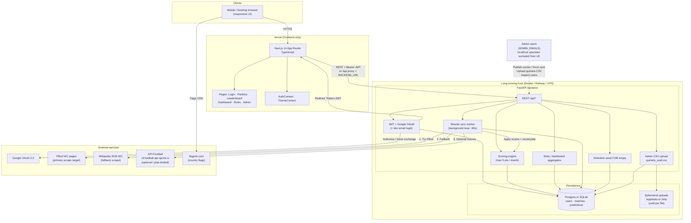
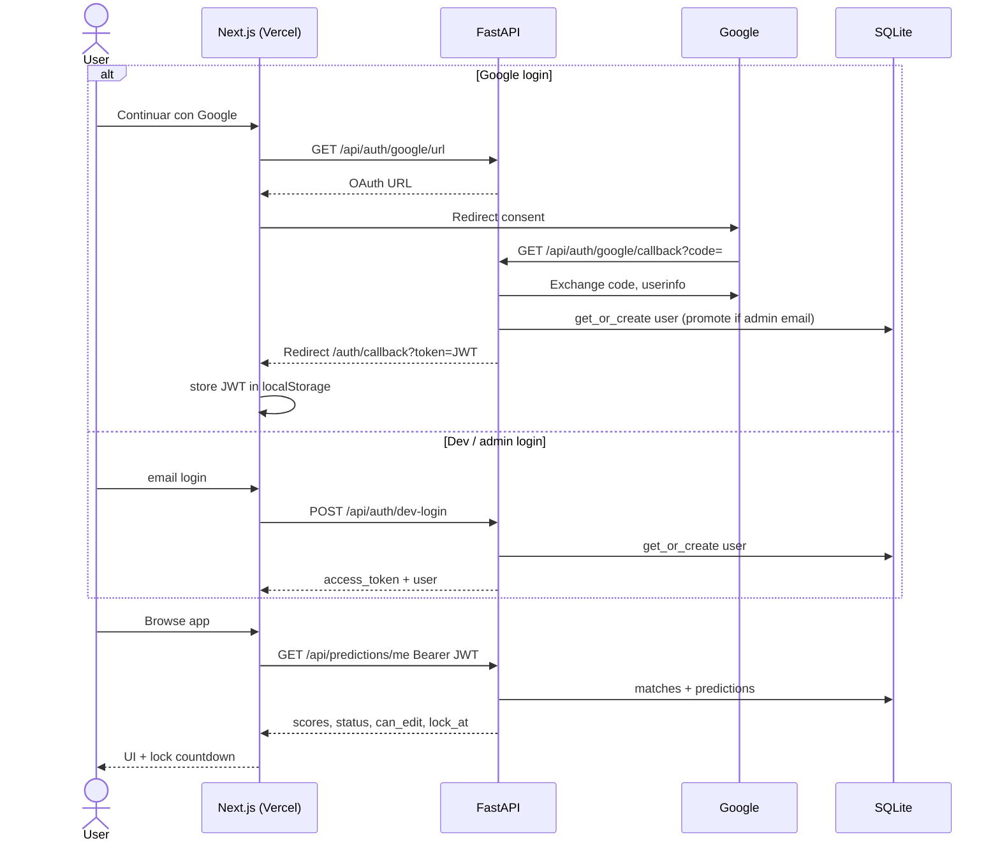
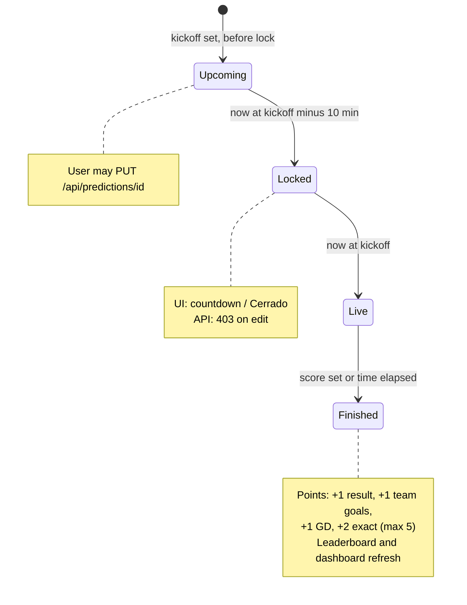
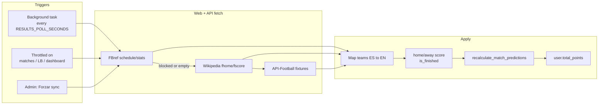
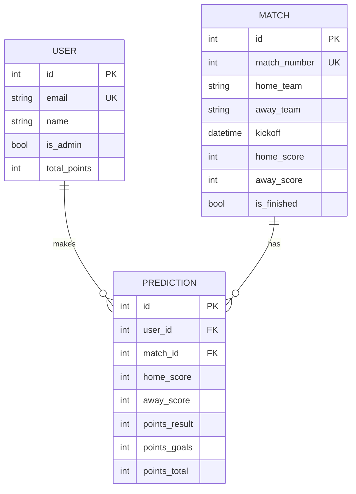

# WC Fantasy 2026 — Quiniela Mundial

Web app for tracking World Cup 2026 predictions among a private group. Users sign in with Google, enter scores for each match, compete on a live leaderboard, and only edit their own future predictions (locked **10 minutes** before kickoff).

## Stack

| Layer | Tech |
|-------|------|
| Backend | Python 3.12, FastAPI, SQLAlchemy |
| Frontend | Next.js 14 (App Router), TypeScript, mobile-first CSS |
| Auth | Google OAuth (+ email/dev login for local) |
| Deploy | Frontend → **Vercel**; Backend → **Railway** / Docker / VPS (long-running host) |
| Data | **Postgres** (`DATABASE_URL`) in production; **SQLite** in Docker volume for local compose |

## Features

- **Predictions**: each user only edits their own scores
- **Lock window**: cannot edit past games, live games, or within 10 min of kickoff
- **Scoring** (cumulative, max 5/match): +1 winner/draw, +1 goals of at least one team, +1 goal difference, +2 exact score
- **Leaderboard**: recalculates when admin publishes real results or auto-sync finds scores
- **Flags**: country flags via [flagcdn.com](https://flagcdn.com)
- **Admins** (configured emails + local `admin@localhost.dev`): manage scores, inspect users, **upload quiniela CSV**; real admins appear on leaderboard & stats
- **Spectator only**: `admin@localhost.dev` (`SUPER_ADMIN_EMAIL`) is excluded from leaderboard/dashboard (dev tool, not a player)
- **Bootstrap**: on empty DB, seeds **match schedule** from code (no CSV required at container start)
- **Quiniela import** (admin only): drag-and-drop CSV in Admin; each upload is stored as a **new** `{stem}_{uuid}.csv` and predictions are upserted into the DB (not reused; no host mount / image copy required)
- **Responsive**: bottom nav, touch-friendly score inputs (phone-first)

## Quiniela CSV template

Use these files to see the expected sheet structure (or start a blank import):

| File | Description |
|------|-------------|
| [**docs/quiniela_template.csv**](docs/quiniela_template.csv) | Full header + **3 example players** (`alice@example.com`, `bob@example.com`, `carol@example.com`) |
| [**docs/quiniela_template_blank.csv**](docs/quiniela_template_blank.csv) | Same header + one empty row to fill |
| [**docs/QUINIELA_CSV.md**](docs/QUINIELA_CSV.md) | Column rules, score format, import behavior |

**Quick rules:** column 2 = email; match columns named `Partido N: Home-Away`; scores like `2-1` or `0-0`; empty cells are skipped.

## Project layout

```
wc-fantasy/
├── backend/           # FastAPI
│   ├── app/
│   │   ├── main.py
│   │   ├── models.py
│   │   ├── seed.py        # schedule seed + admin CSV import
│   │   ├── teams.py       # MATCH_KICKOFFS_UTC / schedule revision
│   │   └── ...
│   ├── Dockerfile         # compose + Railway: build context = repo root
│   ├── Dockerfile.railway # same as Dockerfile (alias)
│   └── requirements.txt
├── frontend/          # Next.js (Vercel)
│   ├── app/
│   │   └── admin/         # scores, user inspect, CSV dropzone
│   ├── components/
│   ├── lib/
│   └── Dockerfile
├── data/              # optional local sqlite only; NOT required for compose/boot
├── docs/              # DEPLOY.md, Vercel/Railway notes, quiniela CSV templates
│   ├── quiniela_template.csv       # examples
│   ├── quiniela_template_blank.csv # fill-in blank
│   └── QUINIELA_CSV.md             # format guide
├── docker-compose.yml # backend + frontend; sqlite volume only (no quiniela mount)
├── package.json       # npm workspaces (Vercel / monorepo root)
└── README.md
```

## Architecture

High-level system design (Mermaid; renders on GitHub and most Markdown viewers).

### System overview



### Auth & prediction flow



### Match status & edit lock



### Auto results pipeline



### Data model



### Deploy topology

| Piece | Where | Why |
|--------|--------|-----|
| Next.js | **Vercel** | SSR/CDN frontend; optional `/api/*` proxy via `BACKEND_URL` |
| FastAPI + worker | **Railway** / Docker / VPS | Background scrape, long-lived process |
| Database | **Postgres** (`DATABASE_URL`) on Railway; **SQLite** volume locally | Players, scores, predictions |
| Quiniela CSV | **Admin upload only** (runtime `quiniela_<uuid>.csv`) | Not mounted, not required at boot |
| Secrets | Env (`.env` / host / Railway / Vercel) | `SECRET_KEY`, `GOOGLE_*`, `DATABASE_URL`, `FOOTBALL_API_KEY`, `ADMIN_EMAILS` |

**Admins** (e.g. emails in `ADMIN_EMAILS`): manage scores, upload quiniela, and **appear** on leaderboard/dashboard.  
**Exception:** `admin@localhost.dev` (`SUPER_ADMIN_EMAIL`) — spectator/dev only, **excluded** from rankings.

More detail: [`docs/DEPLOY.md`](docs/DEPLOY.md), [`docs/BACKEND_DEPLOY.md`](docs/BACKEND_DEPLOY.md), [`docs/VERCEL.md`](docs/VERCEL.md).

## Quick start (Docker)

Containers start **without** any `quiniela.csv` on the host or in the image. First boot creates the match schedule from code; users/predictions come from Google/dev login and/or admin CSV upload.

```bash
cp .env.example .env
make build
make up
# optional: ensure schema + schedule seed if DB empty
make migrate
```

Or without Make:

```bash
docker compose up --build -d
```

| Make target | What it does |
|-------------|--------------|
| `make build` | Build images |
| `make up` | Start stack (detached) |
| `make down` | Stop containers (keeps DB volume) |
| `make remove` | Stop + remove images/containers (DB volume kept) |
| `make remove-volume` | **Delete** SQLite volume (destructive; confirms) |
| `make migrate` | `create_all` + seed schedule (and optional local CSV if present) if DB empty |
| `make migrate-force` | Wipe data & re-seed (confirms) |
| `make sync` | Force FBref/Wikipedia/API score sync |
| `make logs` | Tail logs |
| `make help` | List targets |
| `make test` | Backend + frontend unit tests (fast) |
| `make test-cov` | Unit tests with coverage reports |
| `make test-backend` / `test-frontend` | One side only |
| `make test-install` | Install pytest/jest deps |

### Testing (unit only, no e2e)

```bash
make test-install   # once
make test           # rapid: pytest + jest
make test-cov       # with coverage (backend html + frontend lcov)
```

- **Backend**: `pytest` under `backend/tests/` (mocks for DB/network/IO). Coverage: `backend/coverage_html/`.
- **Frontend**: `jest` + Testing Library under `frontend/**/__tests__/`. Coverage: `frontend/coverage/`.

- Frontend: http://localhost:3000  
- Backend API: http://localhost:8000/docs  
- Super admin: login page → “Login por email” → `admin@localhost.dev`  

Local compose uses SQLite in the Docker volume `wc_fantasy_sqlite` mounted at `/app/data` (DB only — **no** quiniela bind mount). **Do not remove this volume** if you care about local data.

```bash
# Backup local SQLite DB
docker run --rm -v wc_fantasy_sqlite:/data -v $(pwd):/backup alpine \
  cp /data/wc_fantasy.db /backup/wc_fantasy.backup.db
```

## Local development (without Docker)

### Backend

```bash
cd backend
python -m venv .venv && source .venv/bin/activate
pip install -r requirements.txt
export DATABASE_URL="sqlite:///$(pwd)/../data/wc_fantasy.db"
export FRONTEND_URL=http://localhost:3000
export BACKEND_URL=http://localhost:8000
export SUPER_ADMIN_EMAIL=admin@localhost.dev
uvicorn app.main:app --reload --port 8000
```

### Frontend

```bash
cd frontend
npm install
cp .env.local.example .env.local   # NEXT_PUBLIC_API_URL=http://localhost:8000
npm run dev
```

## Google OAuth (production)

1. Create credentials in [Google Cloud Console](https://console.cloud.google.com/) (OAuth 2.0 Web client).
2. Authorized redirect URI: `https://<your-api-host>/api/auth/google/callback`
3. Set env vars:
   - `GOOGLE_CLIENT_ID`
   - `GOOGLE_CLIENT_SECRET`
   - `BACKEND_URL` = public API URL
   - `FRONTEND_URL` = public Vercel URL

Flow: user clicks “Continuar con Google” → backend exchanges code → redirects to `/auth/callback?token=JWT`.

Without Google credentials, the app falls back to **dev email login** (fine for local; restrict in production via not exposing the endpoint or requiring OAuth only).

## Admin workflow

1. Log in as an admin (`ADMIN_EMAILS` or `SUPER_ADMIN_EMAIL` locally).
2. Open **Admin** tab.
3. **Resultados**
   - **Quiniela CSV**: drag-and-drop (or click) an export of the group sheet → **Importar CSV subido**. Optional checkbox to also run official results sync + recalc after import.
   - Start from the [CSV template](docs/quiniela_template.csv) if you need the column layout ([format guide](docs/QUINIELA_CSV.md)).
   - Each upload is saved as a **new** file (`{original_stem}_{uuid}.csv`) under a writable dir (`QUINIELA_DATA_DIR` if set, else `/app/data`, else `/tmp` on read-only hosts like Railway image layers). Uploads are **not** reused — upload again whenever the sheet changes.
   - Publish a single match score manually, or **Forzar sync** for FBref/Wikipedia/API.
4. **Ver usuario**: select a player to inspect all their predictions (cannot edit theirs).

API (admin JWT, multipart **file required**):

```http
POST /api/admin/import-quiniela?update_existing=true&also_sync_results=false
Content-Type: multipart/form-data
file=<quiniela.csv>
```

See also [`docs/DEPLOY.md`](docs/DEPLOY.md) §5 and [`docs/QUINIELA_CSV.md`](docs/QUINIELA_CSV.md).

## Scoring rules

Points are **cumulative** (max **5** per match; max **3** without exact score):

| Condition | Points |
|-----------|--------|
| Correct winner / draw | +1 |
| Goals of at least one team correct | +1 |
| Correct goal difference | +1 |
| Exact scoreline | +2 |
| **Max per match** | **5** |

Example (actual `2-1`): exact `2-1` = 5 pts; `1-0` = 2 pts (winner + GD); `2-0` = 2 pts (winner + one team goals); `0-1` = 1 pt; `0-2` = 0 pts.

## Production deploy (recommended)

| Piece | Platform | Notes |
|--------|-----------|--------|
| Frontend | **Vercel** | Next.js only; root or `frontend/` as Root Directory |
| Backend | **Railway** (or Docker/VPS) | `backend/Dockerfile`, build context = **repo root** (`railway.toml`) |
| DB | **Postgres** | Set `DATABASE_URL` on the backend service |

### Vercel (frontend only)

Vercel should host **only** the Next.js app. FastAPI must run elsewhere — not as a second “service” in `vercel.json`.

**Option A — monorepo root (default):** Root Directory empty / `.`; root `package.json` workspace builds `frontend`.

**Option B:** Root Directory = `frontend`.

| Env (Vercel) | Example |
|--------------|---------|
| `NEXT_PUBLIC_API_URL` | `https://your-api.up.railway.app` (public FastAPI, no trailing slash) |
| `BACKEND_URL` | Same API origin if you use the Next `/api/[...path]` proxy |

### Backend (Railway / Docker)

1. Deploy FastAPI with Docker (`backend/Dockerfile` + repo-root context, or compose on a VPS).
2. `DATABASE_URL` = Postgres connection string (production).
3. `FRONTEND_URL` = Vercel app URL (CORS + post-OAuth redirects).
4. `BACKEND_URL` = public API URL (Google OAuth **Authorized redirect URI** must be `https://<BACKEND_URL>/api/auth/google/callback`).
5. `SECRET_KEY`, `GOOGLE_CLIENT_ID`, `GOOGLE_CLIENT_SECRET`, `ADMIN_EMAILS`.
6. Optional: `FOOTBALL_API_KEY`, `QUINIELA_DATA_DIR` (writable path if you attach a volume for uploads).

**No `quiniela.csv` in the image or compose mounts.** Import sheet data from Admin when needed; predictions persist in the database.

> Vercel serverless is not suitable for this FastAPI worker (background scrape, long-lived process). Keep the API on Railway/Docker/VPS.

## API overview

| Method | Path | Description |
|--------|------|-------------|
| GET | `/api/health` | Health |
| GET | `/api/auth/google/url` | Start Google OAuth |
| POST | `/api/auth/dev-login` | Dev/admin email login |
| GET | `/api/auth/me` | Current user |
| GET | `/api/matches` | All matches + status |
| GET | `/api/predictions/me` | My predictions |
| PUT | `/api/predictions/{match_id}` | Save prediction (own, if editable) |
| GET | `/api/leaderboard` | Full ranking |
| GET | `/api/dashboard` | Stats / accuracy dashboard |
| GET | `/api/admin/users` | Admin: list users |
| GET | `/api/admin/users/{id}/predictions` | Admin: view one user |
| POST | `/api/admin/matches/{id}/score` | Admin: set real score |
| POST | `/api/admin/import-quiniela` | Admin: multipart `file` CSV → new `*_uuid.csv` + import predictions |
| POST | `/api/admin/sync-results` | Admin: force fetch finished scores |
| GET | `/api/admin/sync-status` | Admin: auto-sync configuration |
| POST | `/api/admin/recalculate` | Admin: recalc all points |
| POST | `/api/admin/refresh-kickoffs` | Admin: refresh kickoffs from schedule constants |

## Auto results (post-match)

After a match’s expected end (`kickoff` + `MATCH_DURATION_MINUTES`, default ~110 min), the backend tries to pull the final score and recalculates the leaderboard.

| Order | Source |
|-------|--------|
| 1 | **FBref** World Cup stats / scores & fixtures |
| 2 | **Wikipedia** 2026 FIFA World Cup (if FBref blocked) |
| 3 | **API-Football** (optional; free tier often limited for season 2026) |

| Mechanism | Detail |
|-----------|--------|
| Background worker | Polls every `RESULTS_POLL_SECONDS` (default 60s) |
| On read | Leaderboard / matches / my predictions / dashboard trigger a throttled sync (~45s) |
| Priority window | First `RESULTS_FETCH_WINDOW_MINUTES` (default 5) after expected end; retries continue if score still missing |
| Fallback | Admin sets score manually or hits **Forzar sync** in Admin |

Optional: set `FOOTBALL_API_KEY` (from [api-football.com](https://www.api-football.com/)) in env / Docker.

## License

Private / internal use for your quiniela group.
